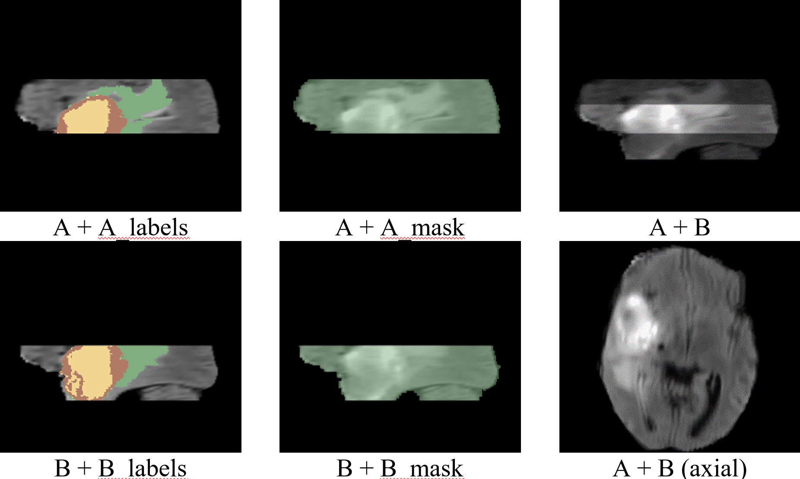
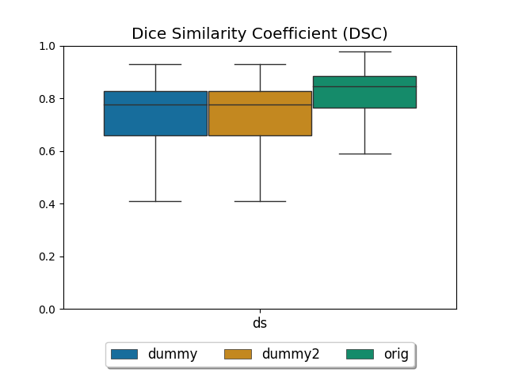
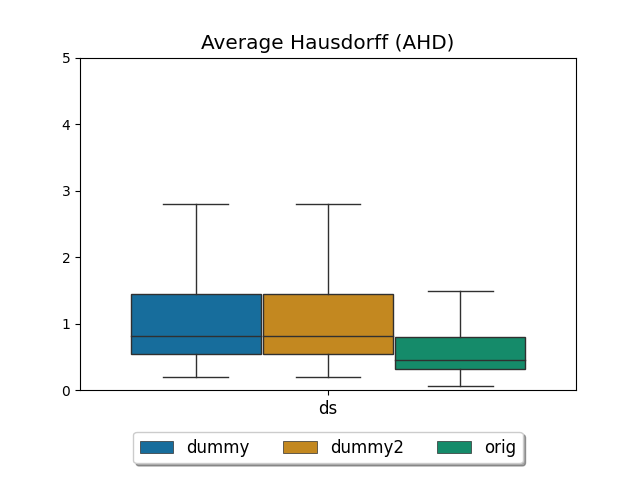

# Slab synthesis and evaluation

## Background
This project contains code to synthesize overlapping slabs (i.e., partial volumes) from images of the Medical Segmentation Decathlon [1] dataset.
The synthetic slabs can be used to train and evaluate an unsupervised registration model such as Voxelmorph [2].

The code is published to establish the baseline dataset referenced in the paper "Deformable Registration of Low-overlapping Medical Images." by Sabrowsky-Hirsch et al. 2022.

To roughly summarize our method, given an input volume,
the method creates to slabs (partial volumes) that overlap along the longitudinal axis and deforms one of the slabs using
augmentation methods such as scaling and rotations (to a small degree) and perlin noise based displacements (to a higher degree).
The method can be applied to medical images as well as respective segmentation, thus it is possible to train a registration
model on the medical images of the generated slabs as well as evaluate the model by comparing the segmentation in the overlap area
before and after applying the correcting deformation calculated by the registration model.

A full description of our slab synthesis method can be found in our paper.

This software is NOT an FDA/MDR approved medical device/software.

## License

Copyright (c) RISC Software GmbH. All rights reserved.
Licensed under the Apache 2.0 with Commons Clause (see "License.md")
You may not use this file except in compliance with the License.

## Exemplary results
 
Two slabs generated for a sample of the Task01 (BRATS) dataset can be found in the folder /example.
The data is derived from parts of the Medical Decathlon Dataset [1] and as such shared under the same CC-BY-SA 4.0 license. 
For details see the license file /example/license.txt.

## Getting started

Download the Medical Decathlon Dataset from http://medicaldecathlon.com/ to a local folder.
The tar files of the dataset need to be placed within a common directory, which we will further refer to as [source].

Set up your python environment by installing the packages listed in the requirements file.
The easiest method is running the following line in your environment prompt:

`pip install -r requirements.txt`

Finally, the file run/config.py, further referred to as [config] needs two path adjustments.
Set the following attributes within get_config:
- 'source': the path to local dataset directory, aforementioned [source]
- 'root': the path to a local directory, which will be used to store any results, futher referred to as [root].

## How-to

The following sections contain instructions on how to use the run scripts in the order of their intended use.

---
### Step 1: Dataset import

The script 'run/step1_import.py' enumerates all tar files in [source], extracts their content and writes images
to a directory [root]/resource. For each dataset item a pair of images is generated:
- tXX__NAME_YYY__image.nrrd: image data
- tXX__NAME_YYY__label.nrrd: segmentation/label data 

where:
- XX is the task number, e.g., '01'
- NAME is the name of the task, e.g., 'braintumour'
- YYY is the item number, e.g., '001'

You may check the following attributes in [config]:
- 'skip': list of task numbers (as integers) to skip during import
- 'override': whether to override existing items in the target directory.
- 'compress': whether compress output images.

---
### Step 2: Preprocessing
The script 'run/step2_preprocess.py' enumerates all items from [root]/resource and preprocesses them according to the settings defined for the respective task. 
Preprocessing comprises:
- reorientation to LPS coordinates
- calculating a (rough) contour mask of the content, which method is used depends on the task
- cropping the volumes to the contour mask
- resampling to a common spacing, which is calculated as the base spacing multiplied by a task dependent scale factor.

The results are stored in [root]/results/pp.
For each imported item the following images are generated:
- tXX__NAME_YYY__image.nrrd: preprocessed image data
- tXX__NAME_YYY__label.nrrd: preprocessed segmentation/label data 
- tXX__NAME_YYY__mask.nrrd: contour mask of the content

example result files:
- t01__braintumour_001__image.nrrd
- t03__liver_104__label.nrrd

You may check the following attributes in [config]:
- 'spacing': absolute base spacing (in mm) to use. Note, that a relative scale factor is defined for each task. The final spacing for a given task is the result of the base spacing multiplied by the scale factor.
- 'skip': list of task numbers (as integers) to skip during preprocessing
- 'override': whether to override existing items in the target directory.
- 'compress': whether compress output images.
---
### Step 3: Generate samples
The script 'run/step3_generate.py' generates samples, i.e., two synthetic slabs A and B from the preprocessed data. 
The results are stored in [root]/results/samples.
For each preprocessed item the following images are generated:
- DDZZZZ-tXX__NAME_YY(__ch_CC)__S: image data of slab S
- DDZZZZ-tXX__NAME_YY(__ch_CC)__S_label: label data of slab S
- DDZZZZ-tXX__NAME_YY(__ch_CC)__S_mask: contour mask of slab S

where:
- DD is the sample group prefix, e.g., 'ds'
- ZZZZ is the sample number, e.g., '0001'
- CC is the optional channel number for multichannel images, e.g., '01'
- S is the slab identifier, i.e., 'A' or 'B'

example result files:
- ds0000-t01__braintumour_001__ch_01__A.nrrd
- ds0003-t02__heart_029__B_label.nrrd

In addition, a split.json file is generate in [root]/results/pp, if it does not yet exist. 
The file assigns a split (train/test) to every item.

Note: The script exists to demonstrate the generation of slabs, to integrate within a training/prediction routine, you
should look into using the generator employed in the script directly instead of importing the image files.
In the script you can also find documentation on different options to set up the generator for training/prediction, configure splits, etc.

You may check the following attributes in [config]:
- 'sample_count': number of samples to generate, None or negative values indicate no limit
- 'split': split factor, i.e., the percentage of items used for training
- 'tasks': list of decathlon tasks (integer ids) to sample from
- 'shuffle': whether to shuffle samples, in terms of source item, channel, etc.
- 'size': planar size N in the slab volumes of size NxNxM
- 'slices': number of slices M in the slab volumes of size NxNxM
- 'overlap_range': range (min, max) of overlapping slices between the slabs generated for a sample
- 'shift_range': range (min, max) of slices to shift the overlap center from the sample middle
- 'trans_range': range (min, max) of slices to translate one of the resulting slabs from its original position
- 'compress': whether compress output images.
- 'prefix': prefix to group the exported samples by, different sample sets/groups are evaluated separately
---

_Exemplary results for a sample created from Task01 (BRATS), the reference is: braintumour_001__ch_01.
A/B refer to the image data, A_labels/B_labels to the labels/segmentation and A_mask/B_mask to the contour masks.
In the right column A and B are blended, where the bottom image shows an axial slice in the overlap area._

### Step 4: Registration-Dummy (Optional)
The script 'run/step4_register.py' exists to provide a means to test the evaluation scripts before implementing
an actual registration method/model. The script simply generates random deformation fields from perlin noise for each
sample in [root]/results/samples. The script does this for each model specified in the config models list,
and places the resulting deformation fields in a folder [source]/results/warps/[model].

You may check the following attributes in [config]:
- models: a list of models to generate dummy deformation fields for.

### Step 5: Evaluate
The script 'run/step5_evaluate.py' calculates evaluation metrics for all samples.
Each sample is evaluated once with its original slab data and once for each model using
deformed slabs.
To evaluate a model, the resulting displacement field transforms have to be placed for each evaluated sample
in a folder [source]/results/warps/[model] as:
- DDZZZZ-tXX__NAME_YY(__ch_CC)__S_warp(.nrrd)

S indicates the slab to transform. Two transforms for one sample (for both slabs) are not allowed.
The resulting scores are saved to a file [source]/results/eval/scores.pkl.

Note: to test the functionality without an existing registration model, we provide a script to produce dummy
deformation fields with step5, which should be run before the evaluation script. See section 'Appendix: Register-Dummy'.

You may check the following attributes in [config]:
- models: a list of models to evaluate, note that the respectively named folders must exist in [source]/results/warps
- image_metrics: bool, whether to evaluate image (intensity-based) metrics (cor, mmi, msq)
- label_metrics: bool, whether to evaluate label (overlap) metrics (dsc, jc, mo, uo, fpe, fne, vs)
- override: whether to override existing scores

### Step 6: Export results
The script 'run/step6_export.py' generates plots and tables from the evaluated scores.
Based on the scores file [source]/results/eval/scores.pkl, the method will create the following
results in a folder [source]/results/eval/export:
- eval_train.xlsx: statistics (min, max, mean, median, q1, q3, std) for the selected metric for the training split
- eval_test.xlsx: same as eval_train.xslx but for the testing split
- train: plots for every metric, training split
- test: plots for every metric, testing split

You may check the following attributes in [config]:
- export_metric: the metric to export in the table, e.g., 'dsc'
- export_plots: whether to generate plots

_Exemplary plots for the Dice Similarity Coefficient and the Average Hausdorff Distance.
Note, that since the slabs have been augmented 'orig' already contains significant dissimilarities in the overlap area.
As the dummy models introduce even further distortions through the random deformations, their score is of course even worse._

## References

[1] M. Antonelli et al., “The medical segmentation decathlon,” arXiv preprint arXiv:2106.05735, 2021.

[2] G. Balakrishnan, A. Zhao, M. R. Sabuncu, J. Guttag, and A. V. Dalca, “Voxelmorph: A learning framework for deformable medical image registration,” IEEE Transactions on Medical Imaging, vol. 38, no. 8, pp. 1788–1800, 2019.

## Citation

B. Sabrowsky-Hirsch, B. Schenkenfelder, C. Klug, G. Reishofer, J. Scharinger,
"Deformable Registration of Low-overlapping Medical Images.",
2022 21st IEEE International Conference on Machine Learning and Applications (ICMLA),
2022, pp. TBD, doi: TBD

## Acknowledgements

This work was funded by the FFG (Austrian Research Promotion Agency)
under the grants 867536 (VizARd), 872604 (MEDUSA) and research subsidies granted by the government of Upper Austria. RISC Software GmbH is
a member of UAR (Upper Austrian Research) Innovation Network.

## Versions

- 0.1: Initial Version
- 1.0: Full code and documentation