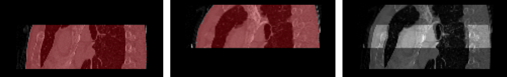

# Slab synthesis and evaluation

## Background
This project contains code to synthesize overlapping slabs (i.e., partial volumes) from images of the Medical Segmentation Decathlon [1] dataset.
The synthetic slabs can be used to train and evaluate an unsupervised registration model such as Voxelmorph [2].

The code is published to establish the baseline dataset referenced in the paper "Deformable Registration of Low-overlapping Medical Images." by Sabrowsky-Hirsch et al. 2022.

## Coming soon
Code and Documentation will be added soon.

## Citation

B. Sabrowsky-Hirsch, B. Schenkenfelder, C. Klug, G. Reishofer, J. Scharinger,
"Deformable Registration of Low-overlapping Medical Images.",
2022 21st IEEE International Conference on Machine Learning and Applications (ICMLA),
2022, pp. TBD, doi: TBD

## References

[1] M. Antonelli et al., “The medical segmentation decathlon,” arXiv preprint arXiv:2106.05735, 2021.

[2] G. Balakrishnan, A. Zhao, M. R. Sabuncu, J. Guttag, and A. V. Dalca, “Voxelmorph: A learning framework for deformable medical image registration,” IEEE Transactions on Medical Imaging, vol. 38, no. 8, pp. 1788–1800, 2019.

## Versions

- 0.1: Initial Version